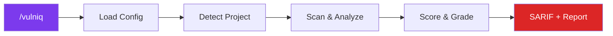
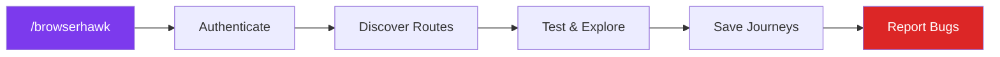
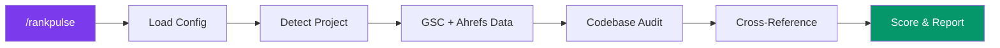

# Agent Skills

A collection of agent skills that extend capabilities across planning, development, and tooling.

## Installation

Install any skill from this repo using the [`skills`](https://skills.sh) CLI:

```bash
# Install BrowserHawk
npx skills add JakubKontra/skills --skill browserhawk

# List all available skills
npx skills add JakubKontra/skills --list

# Install all skills
npx skills add JakubKontra/skills --skill '*'
```

## Skills

### [Vulniq](docs/vulniq.md)

Autonomous security vulnerability scanner for codebases. Detects secrets, XSS, missing security headers, auth issues, OWASP Top 10 patterns, dependency vulnerabilities, and more. Outputs SARIF JSON + human-readable MD reports.



**Features:**
- Zero config required — works out of the box on any JS/TS project
- 10 security categories: secrets, XSS, headers, PII, auth, deps, OWASP, CORS, errors, supply chain
- Hybrid engine: Claude code analysis + npm audit + git history scanning
- Context-aware verification — reads surrounding code to reduce false positives
- SARIF 2.1.0 output for GitHub Code Scanning, VS Code, and other tooling
- Ingest external security audits and track remediation status across scans
- Suppressions, scan history, and custom detection patterns

**Quick start:**
```bash
# Install the skill
npx skills add JakubKontra/skills --skill vulniq

# Run in Claude Code — no config needed
/vulniq

# Optional: create config for customization
cp .claude/skills/vulniq/assets/config.example.json vulniq.config.json
```

[Full documentation](docs/vulniq.md)

---

### [BrowserHawk](docs/browserhawk.md)

Autonomous browser testing agent for any web application. Discovers routes, tests pages, fills forms, finds bugs, and learns from every session via a journey-based memory system.



**Features:**
- Works with any web app via a single config file (`browserhawk.config.json`)
- Uses [agent-browser](https://github.com/nichochar/agent-browser) (fast Rust daemon) for browser automation
- Learns successful interaction patterns as **journeys** — each run gets smarter
- Visual regression testing with baseline screenshots
- Supports form login, OAuth/MSAL, 2FA, or no auth
- Bug reporting to conversation, GitHub issues, or Asana

**Quick start:**
```bash
# Install the skill
npx skills add JakubKontra/skills --skill browserhawk

# Install agent-browser
npm install -g agent-browser && agent-browser install

# Create config in your project root
cp .claude/skills/browserhawk/assets/config.example.json browserhawk.config.json
# Edit browserhawk.config.json with your app's details

# Run in Claude Code
/browserhawk
```

[Full documentation](docs/browserhawk.md)

---

### [RankPulse](docs/rankpulse.md)

Technical SEO diagnostics that combines live data from **Google Search Console** and **Ahrefs** (via MCP) with deep codebase analysis. Finds what's broken, traces it to the code causing it, and tells you exactly how to fix it.



**How it works:**

RankPulse pulls data from three sources and cross-references them:

| Source | What it checks |
|--------|---------------|
| **Google Search Console** (MCP) | Crawl errors, indexing issues, search performance, 32 GSC error types mapped to fixes |
| **Ahrefs** (MCP) | Domain rating, backlinks, keyword rankings, traffic trends, competitor comparison |
| **Codebase** (Grep/Read/Glob) | Meta tags, robots.txt, sitemap, canonicals, structured data, headings, images, links |

The real value is in the cross-referencing: GSC reports "Soft 404" → RankPulse finds the page template returning HTTP 200 with empty content → tells you to return 404 in `getServerSideProps`. Works with any combination of data sources — all three, just one MCP, or code-only.

**Features:**
- 32 GSC error types with root cause analysis, diagnostic steps, and code-level fixes
- 12 code check categories: meta, robots, sitemap, canonical, schema, headings, images, links, i18n, perf
- Framework-aware: Next.js, Nuxt, Gatsby, Astro, SvelteKit, Remix
- Competitor comparison via Ahrefs, trend tracking with baseline snapshots, A-F grading
- Outputs scored Markdown reports with remediation roadmaps to `./reports/`

**Quick start:**
```bash
# Install the skill
npx skills add JakubKontra/skills --skill rankpulse

# Run in Claude Code — no config needed for code-only audit
/rankpulse

# Optional: create config for full features (domain, competitors, check toggles)
cp .claude/skills/rankpulse/assets/config.example.json rankpulse.config.json
```

[Full documentation](docs/rankpulse.md)

## License

[MIT](LICENSE)
