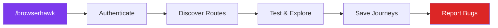

# Agent Skills

A collection of agent skills that extend capabilities across planning, development, and tooling.

## Installation

Install any skill from this repo using the [`skills`](https://skills.sh) CLI:

```bash
# Install BrowserHawk
npx skills add JakubKontra/skills --skill browserhawk

# List all available skills
npx skills add JakubKontra/skills --list

# Install all skills
npx skills add JakubKontra/skills --skill '*'
```

## Skills

### [BrowserHawk](docs/browserhawk.md)

Autonomous browser testing agent for any web application. Discovers routes, tests pages, fills forms, finds bugs, and learns from every session via a journey-based memory system.



**Features:**
- Works with any web app via a single config file (`browserhawk.config.json`)
- Uses [agent-browser](https://github.com/nichochar/agent-browser) (fast Rust daemon) for browser automation
- Learns successful interaction patterns as **journeys** — each run gets smarter
- Visual regression testing with baseline screenshots
- Supports form login, OAuth/MSAL, 2FA, or no auth
- Bug reporting to conversation, GitHub issues, or Asana

**Quick start:**
```bash
# Install the skill
npx skills add JakubKontra/skills --skill browserhawk

# Install agent-browser
npm install -g agent-browser && agent-browser install

# Create config in your project root
cp .claude/skills/browserhawk/assets/config.example.json browserhawk.config.json
# Edit browserhawk.config.json with your app's details

# Run in Claude Code
/browserhawk
```

[Full documentation](docs/browserhawk.md)

## License

[MIT](LICENSE)
