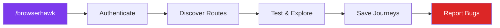
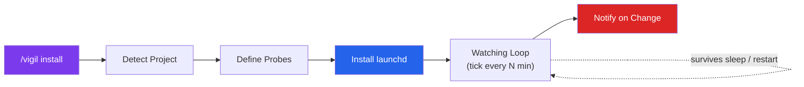
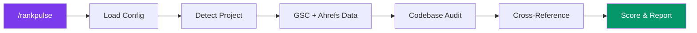
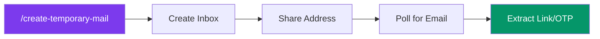
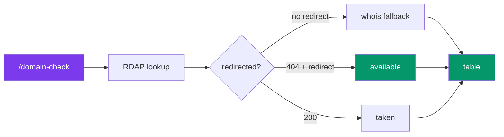

# Agent Skills

A collection of agent skills that extend capabilities across planning, development, and tooling.

## Installation

Install any skill from this repo using the [`skills`](https://skills.sh) CLI:

```bash
# Install BrowserHawk
npx skills add JakubKontra/skills --skill browserhawk

# List all available skills
npx skills add JakubKontra/skills --list

# Install all skills
npx skills add JakubKontra/skills --skill '*'
```

## Skills

### [Vulniq](docs/vulniq.md)

Autonomous security vulnerability scanner for codebases, **aligned to [OWASP APTS](https://github.com/OWASP/APTS) (Autonomous Penetration Testing Standard) Foundation tier**. Detects secrets, XSS, missing security headers, auth issues, OWASP Top 10 patterns, dependency vulnerabilities, and more. Outputs SARIF JSON, Markdown report, and an APTS Conformance Claim — all backed by a tamper-evident, hash-chained audit log and a **code-enforced scan-hook gate** that refuses out-of-order step transitions.

```mermaid
flowchart LR
    A["/vulniq"] --> P["APTS Pre-flight<br/>(RoE + HALT)"]
    P --> HK["scan-hook gate<br/>(13 phases)"]
    HK --> B["Load Config"]
    B --> C["Detect Project"]
    C --> D["Scan & Analyze"]
    D --> E["Score & Grade"]
    E --> K["Conformance Claim"]
    K --> F["SARIF + Report"]
    F --> V["audit-verify<br/>(chain integrity)"]

    style A fill:#7c3aed,color:#fff
    style P fill:#2563eb,color:#fff
    style HK fill:#2563eb,color:#fff
    style K fill:#059669,color:#fff
    style F fill:#dc2626,color:#fff
    style V fill:#059669,color:#fff
```



**Features:**
- Zero config required — works out of the box on any JS/TS project
- 11 security categories: secrets, XSS, headers, PII, auth, deps, OWASP, CORS, errors, supply chain, **manipulation resistance**
- Hybrid engine: Claude code analysis + npm audit + git history scanning
- Context-aware verification — reads surrounding code to reduce false positives
- SARIF 2.1.0 output with per-finding `confidenceScore`, `validationStatus`, and `evidenceHash` (SHA-256)
- **Scan-hook enforcement** — 13 ordered phases; CLI refuses skipped/out-of-order calls, moves 6 APTS reqs from agent-dependent to code-enforced
- **Tamper-evident audit log** with SHA-256 hash chain; `audit-verify` detects any mutation
- **Kill switch + pause** with full state snapshot dump (APTS-HO-006, HO-008)
- Ingest external security audits and track remediation status across scans
- Suppressions, scan history, and custom detection patterns

**APTS-aligned governance (Foundation tier, all 8 domains — 52 met / 7 partial / 12 N/A of 71 Foundation reqs):**

| Domain | Coverage | What we do |
|---|---|---|
| **SE — Scope Enforcement** | 6/8 met, 2 N/A | Machine-parseable `vulniq.roe.json` with allowed/forbidden paths, scan window, asset criticality tiers; pre-action scope check per file; temporal boundaries with ms precision |
| **SC — Safety Controls** | 4/6 met, 1 partial, 1 N/A | Three independent kill switches (≤5s halt), CIA-LOW read-only posture, per-step timeout, post-scan `git status` integrity check, externally-enforced action allowlist |
| **HO — Human Oversight** | 11/13 met, 2 partial | Authority Delegation Matrix, pause with full state snapshot (HO-006), one-click halt + state dump (HO-008), mid-scan scope redirection (HO-007), escalation triggers for low-confidence/scope-drift/legal violations |
| **AL — Graduated Autonomy** | 6/11 met, 1 partial, 4 N/A | Declared **Level L3**; formal boundary document with every-30-ops re-hash; ≤5s termination; 12 mandatory audit-log fields |
| **AR — Auditability** | 6/7 met, 1 partial | Hash-chained NDJSON audit log (SHA-256), ms-timestamped schema-validated events, `audit-verify` command, 4-tier evidence classification |
| **MR — Manipulation Resistance** | 8/13 met, 2 partial, 3 N/A | Architectural trust separation, authority-claim detection, secondary-channel prevention, cryptographic scope integrity monitoring |
| **TP — Third-Party & Supply Chain** | 8/10 met, 2 N/A | Foundation Model disclosure, provider vetting doc, incident response procedures, SBOM (Node stdlib only), automated credential/PII discovery, per-project tenant isolation |
| **RP — Reporting** | 3/3 met | FP-rate methodology, vulnerability-class coverage matrix, executive summary for non-technical stakeholders |

> Standard: [OWASP APTS](https://github.com/OWASP/APTS) (CC BY-SA 4.0) — 71 Foundation-tier requirements across 8 domains. Vulniq's conformance mapping lives in [`vulniq/references/apts-compliance.md`](vulniq/references/apts-compliance.md); the machine-readable checklist is [`vulniq/references/apts-foundation.json`](vulniq/references/apts-foundation.json). Run `vulniq apts-checklist` at any time for a live coverage summary.

**Developer tooling & integrations:**

| Surface | What you get | Link |
|---|---|---|
| **CLI binary** | After `npm link` (or `npx`), the short form `vulniq <cmd>` works on PATH; `vulniq --help` lists all 20 commands | `vulniq/bin/vulniq` |
| **JSON Schemas** | Draft-2020-12 schemas for `vulniq.roe.json`, `vulniq.config.json`, audit-log entries, SARIF extensions, and the APTS requirement catalogue — validates with `ajv` or VS Code `json.schemas` | [`vulniq/schemas/`](vulniq/schemas/) |
| **GitHub Action** | Composite action runs governance gate (RoE validate → audit-verify → conformance → SARIF upload to Code Scanning) | [`vulniq/actions/vulniq/`](vulniq/actions/vulniq/) |
| **CI workflows** | Parallel test + governance-gate jobs on every push; tag-triggered release workflow | [`.github/workflows/vulniq-example.yml`](.github/workflows/vulniq-example.yml) |
| **Test suite** | 69 tests (`node --test`, zero deps) covering hash chain, RoE validation, conformance, CLI integration, scan-hook enforcement | [`vulniq/test/`](vulniq/test/) |
| **Worked example** | End-to-end `/vulniq` session walkthrough | [`vulniq/docs/worked-example.md`](vulniq/docs/worked-example.md) |

**Quick start:**
```bash
# Install the skill
npx skills add JakubKontra/skills --skill vulniq

# Run the full scan in Claude Code
/vulniq

# Optional: create config + Rules of Engagement
cp .claude/skills/vulniq/assets/config.example.json vulniq.config.json
cp .claude/skills/vulniq/assets/vulniq.roe.example.json vulniq.roe.json

# Optional: put the short `vulniq` binary on PATH
(cd .claude/skills/vulniq && npm link)

# Inspect APTS coverage, verify audit chain, or generate a claim at any time
vulniq apts-checklist
vulniq audit-verify
vulniq conformance
vulniq --help           # full command reference
```

[Full documentation](docs/vulniq.md) · [Worked example](vulniq/docs/worked-example.md) · [CHANGELOG](vulniq/CHANGELOG.md) · [Migration 1.1 → 1.2/1.3](vulniq/MIGRATION.md)

---

### [BrowserHawk](docs/browserhawk.md)

Autonomous browser testing agent for any web application. Discovers routes, tests pages, fills forms, finds bugs, and learns from every session via a journey-based memory system.



**Features:**
- Works with any web app via a single config file (`browserhawk.config.json`)
- Uses [agent-browser](https://github.com/nichochar/agent-browser) (fast Rust daemon) for browser automation
- Learns successful interaction patterns as **journeys** — each run gets smarter
- Visual regression testing with baseline screenshots
- Supports form login, OAuth/MSAL, 2FA, or no auth
- Bug reporting to conversation, GitHub issues, or Asana

**Quick start:**
```bash
# Install the skill
npx skills add JakubKontra/skills --skill browserhawk

# Install agent-browser
npm install -g agent-browser && agent-browser install

# Create config in your project root
cp .claude/skills/browserhawk/assets/config.example.json browserhawk.config.json
# Edit browserhawk.config.json with your app's details

# Run in Claude Code
/browserhawk
```

[Full documentation](docs/browserhawk.md)

---

### [Vigil](docs/vigil.md)

macOS-native self-supervising watchdog for your project. Launch it once and it keeps watching in the background — surviving terminal close, sleep, and restart — running read-only health probes (tests, build, dependency audit, a localhost health URL, git drift, disk space) and firing native macOS notifications plus an optional spoken summary when something changes or breaks. **launchd owns the loop, not your Claude session — and no LLM runs in it**, so watching is free, offline, and instant. A second **task-completion mode** flips this around: give a plain-language task and Vigil periodically uses a read-only AI judge to check whether it's *done*, then notifies you and uninstalls itself (one-shot).



**How it works:**

| Phase | Who | What happens |
|-------|-----|--------------|
| **Detect & design** | Claude (once) | Inspects your project, proposes read-only probes for your stack. Approved `shell` commands become a locked allowlist — nothing else can ever run |
| **Install** | Claude (once) | Writes `vigil.config.json` and loads a per-user launchd LaunchAgent (`~/Library/LaunchAgents/com.vigil.<slug>.plist`) |
| **Watch** | launchd (autonomous) | Every N min runs a **pure-Node `tick`, no LLM**: `caffeinate` to stay awake → run probes → compare to the last snapshot → notify **only on a state change** → record. Survives terminal close, sleep, and restart |
| **Check in & triage** | You + Claude (on demand) | `status` / `history` any time; `/vigil triage` re-runs a failing probe, traces it to the code, and proposes a fix — never commits |

**Features:**
- macOS-native: a per-user launchd agent keeps watching after you close the terminal, sleep, or restart — the loop never depends on a live Claude session
- No LLM in the loop — launchd runs a deterministic, pure-Node `tick`; Claude only helps set up and triage, so watching costs nothing and works offline
- 4 health probe types — `shell` (tests/build/audit), `http` (localhost health URL), `git` (drift), `disk` (free space)
- Native macOS notifications + optional spoken summary (`say`); anti-spam — notifies only when a probe's state **changes**, never every interval
- Read-only by default, **code-enforced**: exact-match command allowlist + destructive-op denylist; no commits, deploys, or sudo; writes only inside `.vigil/` and the single launchd plist
- Stays awake during a probe with `caffeinate`; honest about `pmset`/sudo for guaranteed overnight wakes
- On-demand triage — ask Claude to investigate the latest failing probe and trace it to the code
- **Task-completion mode** — `vigil task "<description>"`: a read-only `claude -p` judge checks each tick whether your task is done, then notifies and self-uninstalls (one-shot). Costs tokens per check (LLM in the loop); the only mode that does
- **Works on a Claude subscription _or_ an API key** — task mode uses your existing Claude Code login by default (no API key); on a subscription each check draws from your normal usage limits (not a separate charge). It also works headless with `ANTHROPIC_API_KEY` or a `CLAUDE_CODE_OAUTH_TOKEN` from `claude setup-token`
- One config file (`vigil.config.json`); check in with `status` / `history`, pause with `halt`, stop with `stop`

**Quick start:**
```bash
# Install the skill
npx skills add JakubKontra/skills --skill vigil

# Run in Claude Code — it detects your project, proposes probes, and installs the watcher
/vigil install

# …or watch a task and get told when it's done (then it stops itself)
/vigil task "add TypeScript types to every component in src/components/forms/"

# Check in any time (works with no terminal open)
node .claude/skills/vigil/scripts/cli.mjs status

# Ask Claude what broke, then stop watching
/vigil triage
/vigil stop

# Optional: start from the template config
cp .claude/skills/vigil/assets/config.example.json vigil.config.json
```

[Full documentation](docs/vigil.md)

---

### [RankPulse](docs/rankpulse.md)

Technical SEO diagnostics that combines live data from **Google Search Console** and **Ahrefs** (via MCP) with deep codebase analysis. Finds what's broken, traces it to the code causing it, and tells you exactly how to fix it.



**How it works:**

RankPulse pulls data from three sources and cross-references them:

| Source | What it checks |
|--------|---------------|
| **Google Search Console** (MCP) | Crawl errors, indexing issues, search performance, 32 GSC error types mapped to fixes |
| **Ahrefs** (MCP) | Domain rating, backlinks, keyword rankings, traffic trends, competitor comparison |
| **Codebase** (Grep/Read/Glob) | Meta tags, robots.txt, sitemap, canonicals, structured data, headings, images, links |

The real value is in the cross-referencing: GSC reports "Soft 404" → RankPulse finds the page template returning HTTP 200 with empty content → tells you to return 404 in `getServerSideProps`. Works with any combination of data sources — all three, just one MCP, or code-only.

**Features:**
- 32 GSC error types with root cause analysis, diagnostic steps, and code-level fixes
- 12 code check categories: meta, robots, sitemap, canonical, schema, headings, images, links, i18n, perf
- Framework-aware: Next.js, Nuxt, Gatsby, Astro, SvelteKit, Remix
- Competitor comparison via Ahrefs, trend tracking with baseline snapshots, A-F grading
- Outputs scored Markdown reports with remediation roadmaps to `./reports/`

**Quick start:**
```bash
# Install the skill
npx skills add JakubKontra/skills --skill rankpulse

# Run in Claude Code — no config needed for code-only audit
/rankpulse

# Optional: create config for full features (domain, competitors, check toggles)
cp .claude/skills/rankpulse/assets/config.example.json rankpulse.config.json
```

[Full documentation](docs/rankpulse.md)

---

### [Temp Email](docs/temp-email.md)

Disposable email inboxes on demand via the tempmail.lol API. Create throwaway addresses for E2E testing, account registration, email verification, and OTP confirmation. No dependencies, no API key — just `curl`.



**Features:**
- Zero config — works immediately with no API key
- Domain rotation — reduces blocklist risk
- Smart extraction — parses HTML emails for verification URLs, OTP codes, magic links
- Multi-inbox support — label and manage multiple inboxes for complex flows
- Local persistence — inboxes stored in `.temp-email/` for session continuity

**Quick start:**
```bash
# Install the skill
npx skills add JakubKontra/skills --skill temp-email

# Run in Claude Code — no config needed
/create-temporary-mail

# Optional: create config for custom poll timing
cp .claude/skills/temp-email/assets/config.example.json temp-email.config.json
```

[Full documentation](docs/temp-email.md)

---

### [Domain Check](docs/domain-check.md)

Domain availability checks done right. Queries **RDAP** (the structured successor to whois) and falls back to **whois** for TLDs RDAP doesn't cover — so `.io`, `.co`, `.me` and other ccTLDs return trustworthy answers instead of a naive "404 = available" false positive. No dependencies — Node's built-in `fetch` plus the system `whois` binary when present.



**Features:**
- Correct ccTLD handling — distinguishes a registry "not found" from "RDAP doesn't cover this TLD"
- `whois` fallback resolves `.io` / `.co` / `.me` / `.sh` when RDAP can't
- Registration date, expiry date, and registrar for taken domains
- Three modes: `check` exact domains, `scan` a base across TLDs, `suggest` available brandable variations
- Bounded concurrency, zero dependencies, JSON output

**Quick start:**
```bash
# Install the skill
npx skills add JakubKontra/skills --skill domain-check

# Run in Claude Code
/domain-check

# Or call the CLI directly
node .claude/skills/domain-check/scripts/cli.mjs check acme.com acme.io
node .claude/skills/domain-check/scripts/cli.mjs scan acme
node .claude/skills/domain-check/scripts/cli.mjs suggest acme
```

[Full documentation](docs/domain-check.md)

## License

[MIT](LICENSE)
