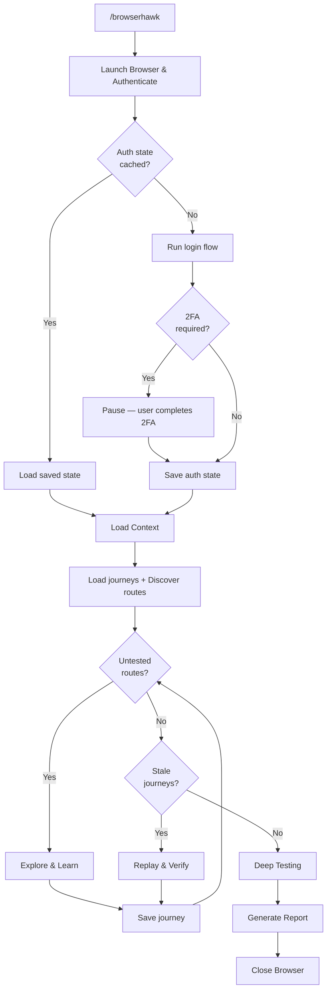
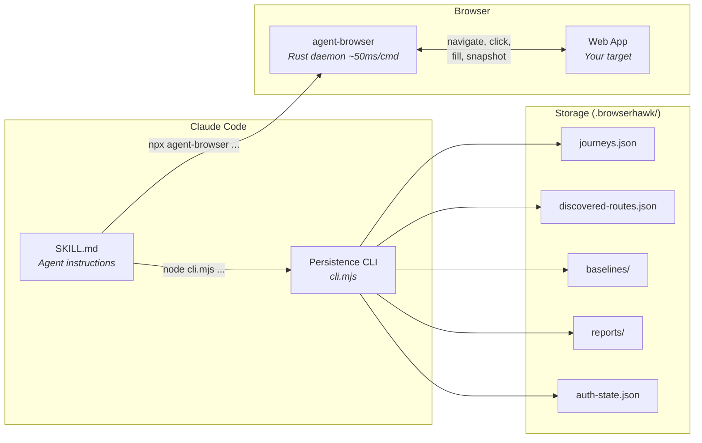
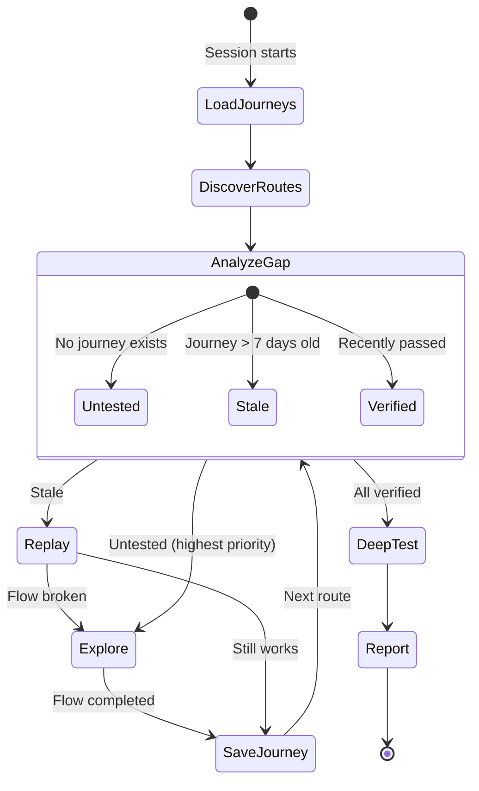
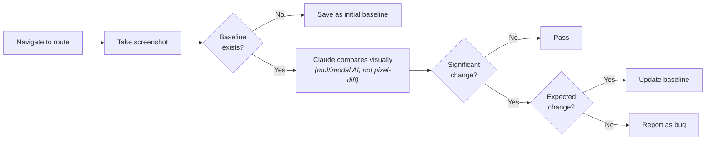

# BrowserHawk

Autonomous browser testing agent for any web application. BrowserHawk discovers routes, tests pages, fills forms, finds bugs, and learns from every session — so each run gets smarter.

## How It Works

BrowserHawk is a Claude Code skill that turns Claude into an autonomous QA agent. It uses [`agent-browser`](https://github.com/nichochar/agent-browser) (a fast Rust-based browser daemon) for all browser interactions and a persistence CLI for journeys, discovery, baselines, and reports.



### Key Features

- **Works with any web app** — all app-specific details come from a single config file
- **Learns from every session** — successful interaction patterns are saved as journeys and replayed next time
- **Visual regression** — screenshots compared against baselines
- **Smart prioritization** — untested routes first, then stale, skip recently verified
- **Multiple auth flows** — form login, OAuth/MSAL redirect, 2FA with manual intervention, or no auth
- **Bug reporting** — conversation, GitHub issues, or Asana tasks

## Prerequisites

- [agent-browser](https://github.com/nichochar/agent-browser) installed globally:
  ```bash
  npm install -g agent-browser && agent-browser install
  ```
- [dotenv](https://www.npmjs.com/package/dotenv) available (for credential loading):
  ```bash
  npm install dotenv
  ```

## Installation

### Claude Code

Copy the `browserhawk/` directory into your project's `.claude/skills/` directory:

```bash
# From your project root
mkdir -p .claude/skills
cp -r <path-to-skills-repo>/browserhawk .claude/skills/browserhawk
```

Then invoke it with:
```
/browserhawk
```

### Manual Setup

You can also place the skill directory anywhere and point Claude Code to it via your project settings.

## Configuration

Create `browserhawk.config.json` in your project root. Start from the example:

```bash
cp .claude/skills/browserhawk/assets/config.example.json browserhawk.config.json
```

### Minimal Config (No Auth)

```json
{
  "target": "http://localhost:3000",
  "entryPoint": "/",
  "auth": {
    "type": "none"
  }
}
```

### With Form Login

```json
{
  "target": "https://localhost:3000",
  "entryPoint": "/dashboard",
  "auth": {
    "type": "steps",
    "envFile": ".env.browserhawk",
    "steps": [
      { "action": "navigate", "value": "${target}/login" },
      { "action": "fill", "selector": "#email", "envVar": "BROWSERHAWK_EMAIL" },
      { "action": "fill", "selector": "#password", "envVar": "BROWSERHAWK_PASSWORD" },
      { "action": "click", "selector": "button[type='submit']" }
    ],
    "successIndicator": { "type": "url", "value": "/dashboard" }
  }
}
```

### With OAuth/MSAL + 2FA

```json
{
  "target": "https://localhost:3000",
  "entryPoint": "/dashboard",
  "auth": {
    "type": "steps",
    "envFile": ".env.browserhawk",
    "steps": [
      { "action": "navigate", "value": "${target}" },
      { "action": "click", "selector": "button:has-text('Sign in')" },
      { "action": "waitForUrl", "pattern": "**/login.microsoftonline.com/**", "timeout": 15000 },
      { "action": "fill", "selector": "input[type='email']", "envVar": "BROWSERHAWK_EMAIL" },
      { "action": "click", "selector": "input[type='submit']" },
      { "action": "waitForSelector", "selector": "input[name='passwd']", "timeout": 10000 },
      { "action": "fill", "selector": "input[name='passwd']", "envVar": "BROWSERHAWK_PASSWORD" },
      { "action": "click", "selector": "input[type='submit']" },
      { "action": "pause", "value": "Complete 2FA in the browser", "timeout": 120000 }
    ],
    "successIndicator": { "type": "url", "value": "localhost:3000", "timeout": 120000 }
  }
}
```

### Full Config Reference

| Field | Type | Required | Description |
|-------|------|----------|-------------|
| `target` | string | Yes | Base URL (e.g., `"https://localhost:3000"`) |
| `entryPoint` | string | Yes | Path after login (e.g., `"/dashboard"`) |
| `auth.type` | string | No | `"steps"` or `"none"` (default: `"none"`) |
| `auth.envFile` | string | No | Env file path (default: `".env.browserhawk"`) |
| `auth.steps` | array | No | Login step sequence (see auth step actions below) |
| `auth.successIndicator` | object | No | How to verify login succeeded |
| `discovery.maxDepth` | number | No | Crawl depth (default: `3`) |
| `discovery.maxPages` | number | No | Max pages to visit (default: `50`) |
| `discovery.excludePatterns` | array | No | Glob patterns to skip (e.g., `["/auth/*"]`) |
| `discovery.sameDomainOnly` | boolean | No | Stay on target domain (default: `true`) |
| `knownRoutes` | array | No | Pre-seeded routes: `[{ "path": "/foo", "name": "Foo" }]` |
| `bugReporting.target` | string | No | `"conversation"`, `"github"`, or `"asana"` |
| `healthCheck.command` | string | No | Command to check if dev server is running |
| `healthCheck.expectedOutput` | string | No | Expected output from health check |
| `healthCheck.startCommand` | string | No | How to start the dev server (shown to user) |

### Auth Step Actions

| Action | Required Fields | Description |
|--------|----------------|-------------|
| `navigate` | `value` | Go to URL. Use `${target}` placeholder for base URL |
| `click` | `selector` | Click an element |
| `fill` | `selector` + (`envVar` or `value`) | Fill an input. `envVar` reads from env file |
| `waitForUrl` | `pattern` | Wait for URL to match glob pattern |
| `waitForSelector` | `selector` | Wait for element to appear |
| `wait` | — | Wait for `timeout` ms (default 1000) |
| `pause` | `value` (message) | Print message, wait for manual auth (2FA). Default timeout 120s |

All steps accept optional `timeout` (ms, default 10000) and `optional` (boolean — failure doesn't abort).

## Credentials

Create `.env.browserhawk` in your project root:

```bash
BROWSERHAWK_EMAIL=your-test-account@example.com
BROWSERHAWK_PASSWORD=your-password
```

Add to `.gitignore`:
```
.env.browserhawk
.browserhawk/auth-state.json
```

## Architecture



## Persistent Storage

BrowserHawk creates a `.browserhawk/` directory in the project root:

```
.browserhawk/
  baselines/              # Visual regression baseline screenshots
  reports/                # Test run reports (markdown)
  discovered-routes.json  # Accumulated discovered routes
  journeys.json           # Learned interaction patterns
  auth-state.json         # Browser auth state (gitignore this)
```

**What to commit:**
- `baselines/` — if you want shared visual regression baselines
- `reports/` — to keep test history
- `discovered-routes.json` — to share the route map
- `journeys.json` — to share learned patterns across the team

**What to gitignore:**
- `auth-state.json` — contains session cookies

## Journeys (Learning System)

BrowserHawk learns from every session. When it successfully completes a flow (create, edit, navigate, etc.), it saves the steps as a **journey**. On the next run, it replays known journeys and focuses on untested areas.



Journey types: `smoke`, `create`, `edit`, `delete`, `navigation`, `validation`, `explore`.

## CLI Commands

The persistence CLI can be used directly:

```bash
BH="<skill-directory>/scripts"

node $BH/cli.mjs config              # Show resolved config
node $BH/cli.mjs login               # Run auth flow
node $BH/cli.mjs discover            # Discover routes (merges with previous)
node $BH/cli.mjs load-journeys       # Load saved journeys
node $BH/cli.mjs save-journey        # Save journey (pipe JSON via stdin)
node $BH/cli.mjs compare <route>     # Compare screenshot with baseline
node $BH/cli.mjs update-baseline <r> # Update baseline screenshot
node $BH/cli.mjs save-report <desc>  # Save report (pipe markdown via stdin)
node $BH/cli.mjs last-run            # Show last test run info
```

All commands output JSON.

## Visual Regression Flow



## Bug Severity Guide

| Severity | Examples |
|----------|----------|
| **High** | JS errors on page load, 500 errors, pages that don't render, forms that silently fail |
| **Medium** | Visual regressions, broken interactions, validation not working |
| **Low** | Minor layout issues, console warnings |

## Tips

- BrowserHawk prefixes all test data with `"Test-BrowserHawk-"` to avoid polluting real data
- It never deletes real data — only entities it created
- Auth state is cached in `.browserhawk/auth-state.json` so you don't need to log in every time
- If 2FA is required, BrowserHawk will pause and ask you to complete it in the browser
- The more you run it, the smarter it gets — journeys accumulate and coverage grows
