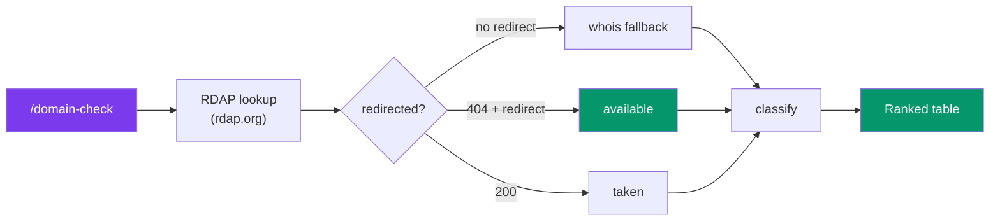

# Domain Check

Domain availability checks done right. Domain Check queries **RDAP** (the structured successor to
whois) and falls back to **whois** for TLDs RDAP doesn't cover, so you get trustworthy answers even
for ccTLDs like `.io` and `.co`. Zero dependencies — Node's built-in `fetch` plus the system
`whois` binary when present.

## What it Does

1. Checks whether specific domains are registered, available, or unknown
2. Sweeps a base name across many TLDs at once
3. Suggests available domains for a new project/brand (TLD sweep + common `get`/`use`/`try` and
   `hq`/`hub`/`go` variants)
4. Returns structured JSON with registration/expiry dates and registrar for taken domains



## Installation

```bash
npx skills add JakubKontra/skills --skill domain-check
```

## Quick Start

```bash
# Run in Claude Code — no config needed
/domain-check

# Or call the CLI directly:
node .claude/skills/domain-check/scripts/cli.mjs check slotly.io acme.com
node .claude/skills/domain-check/scripts/cli.mjs scan slotly
node .claude/skills/domain-check/scripts/cli.mjs suggest slotly

# Optional: create config to tweak TLDs / timeouts
cp .claude/skills/domain-check/assets/config.example.json domain-check.config.json
```

## How availability is determined

`rdap.org` is a redirector to the authoritative registry RDAP server:

| RDAP front-end response | Meaning |
|---|---|
| Redirected → **200** | Registered (**taken**); includes dates + registrar |
| Redirected → **404** | **Available** (registry says it doesn't exist) |
| **404, no redirect** | TLD has no RDAP server (e.g. `.io`, `.co`, `.me`) → **`unknown`** → try `whois` |

This is the crux: a raw "404 = available" check is **wrong** for ccTLDs, which return 404 from the
RDAP front-end while being perfectly registrable/registered. The `whois` fallback resolves those.

## Commands

| Command | Description | Example |
|---------|-------------|---------|
| `config` | Show resolved config | `config` |
| `check <domain...>` | Check exact domains | `check slotly.io acme.com` |
| `scan <base> [--tlds=a,b]` | Sweep a base name across TLDs | `scan slotly --tlds=com,io,sh` |
| `suggest <base>` | Find available domains for a name | `suggest slotly` |

Output is JSON; each result:

```json
{ "domain": "slotly.com", "status": "taken", "source": "rdap",
  "registered": "2010-03-28", "expires": "2026-03-28", "registrar": "GoDaddy.com, LLC" }
```

`status` is one of `available` | `taken` | `unknown`. `source` is `rdap` or `whois`.

## Features

- **Correct ccTLD handling** — distinguishes a registry "not found" from "RDAP doesn't cover this TLD"
- **whois fallback** — resolves `.io`/`.co`/`.me`/`.sh`/etc. when RDAP can't
- **Rich data** — registration date, expiry date, and registrar for taken domains
- **Bulk + suggest** — sweep TLDs or auto-generate brandable variations
- **Concurrent** — bounded parallelism (default 8) for fast multi-domain checks
- **Zero dependencies** — Node stdlib + optional system `whois`

## Use Cases

| Scenario | Command |
|----------|---------|
| "Is `acme.app` free?" | `check acme.app` |
| "Compare `acme` across TLDs" | `scan acme` |
| "Find a domain for my project `acme`" | `suggest acme` |
| "When does this squatted domain expire?" | `check thedomain.com` → read `expires` |

## Configuration

All optional. Create `domain-check.config.json` in your project root:

```json
{
  "rdapBase": "https://rdap.org",
  "timeoutMs": 10000,
  "concurrency": 8,
  "tlds": ["com", "io", "app", "dev", "sh", "co", "net", "org", "ai", "xyz", "me", "so"],
  "suggestPrefixes": ["get", "use", "try", "my"],
  "suggestSuffixes": ["hq", "app", "hub", "go"],
  "suggestTlds": ["com", "app", "io", "dev", "sh"],
  "whoisFallback": true
}
```

| Field | Default | Description |
|-------|---------|-------------|
| `rdapBase` | `https://rdap.org` | RDAP redirector endpoint |
| `timeoutMs` | `10000` | Per-request timeout |
| `concurrency` | `8` | Max parallel lookups |
| `tlds` | see above | TLDs swept by `scan` |
| `suggestPrefixes` / `suggestSuffixes` | see above | Affixes used by `suggest` |
| `suggestTlds` | `com,app,io,dev,sh` | TLDs the exact base is checked against in `suggest` |
| `whoisFallback` | `true` | Use `whois` for TLDs RDAP can't resolve |

## Limitations

- **RDAP coverage** — gTLDs are covered directly; many ccTLDs rely on `whois`. Without a `whois`
  binary, those TLDs return `unknown`.
- **Premium / reserved / recently-expired** domains may read as available yet not be (cheaply)
  purchasable. This answers "registered or not", not pricing.
- **Not a checkout** — always confirm at a registrar before committing to a name.
