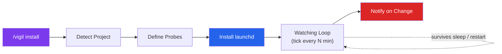

# Vigil

**macOS-native self-supervising watchdog for your project.** Launch it once and it keeps watching
in the background — surviving terminal close, sleep, and restart — running read-only health probes
and firing native macOS notifications when something changes or breaks.

Vigil is *inspired by* the idea of an autonomous agent that works while you're away, but it takes a
fundamentally different, macOS-native approach: instead of an in-process loop that dies when your
Claude session or terminal closes, **launchd owns the heartbeat**. A per-user LaunchAgent runs a
`tick` every N minutes. Nothing stays resident; survival is delegated to the OS.

Vigil has **two modes**:

- **Health watchdog (default, no LLM).** Probes define a healthy steady state; Vigil notifies when
  something *breaks*. The loop is pure Node — free, offline, instant. Claude only helps set up and
  triage.
- **Task completion (one-shot, AI judge).** Give a plain-language task; each tick a **read-only
  `claude -p` judge** decides whether it's *done*. When it is, Vigil notifies and uninstalls itself.
  This mode deliberately puts an LLM in the loop (costs tokens per check).



## How it works

1. **Detect & design** — Claude inspects your project and proposes read-only health *probes*
   tailored to your stack (test suite, build, dependency audit, a localhost health URL, git drift,
   disk space). You confirm or edit; the chosen shell commands become a code-enforced allowlist.
2. **Install** — Vigil writes a `~/Library/LaunchAgents/com.vigil.<slug>.plist` and loads it with
   `launchctl bootstrap`. From then on, launchd runs `cli.mjs tick` on your interval — even with no
   terminal open, across logout and restart.
3. **Watch** — each tick runs the probes (kept awake with `caffeinate`), compares results to the
   last snapshot, and fires a **native notification** (+ optional spoken `say` summary) **only when
   a probe's state changes** — newly broke, recovered, or git drift moved. Steady state is logged,
   never notified, so silence means all-clear.
4. **Check in & triage** — `status` and `history` tell you what's happening any time. Ask Claude to
   `triage` a failing probe and it re-runs it, reads the error, and traces it to the offending code
   — proposing a fix, never applying one.

## Probe types

| Type | Checks | "ok" when |
|------|--------|-----------|
| `shell` | tests / build / audit (allowlisted commands) | exit code matches and command is allowlisted & non-destructive |
| `http` | a localhost health URL | response status matches (GET, localhost-only by default) |
| `git` | working-tree drift | not dirty and within N commits of upstream |
| `disk` | free space | free space ≥ threshold |
| `task` | a plain-language task (AI judge) | a read-only `claude -p` judge returns `done:true` above the confidence threshold |

## Task completion mode

```bash
# One command: watch a task and tell me when it's done, then stop
vigil task "add TypeScript types to every component in src/components/forms/" --interval 15
```

Each tick, Vigil runs a **read-only** Claude Code headless judge (`claude -p` with only
Read/Grep/Glob) that inspects the repo and returns `{done, confidence, reasoning}`. While the task
isn't done, Vigil is silent. When it's judged complete, you get a **"✅ Task done"** notification
(carrying the judge's reasoning) and the launchd agent **uninstalls itself** (one-shot). Vigil only
*judges* completion — it never does the work or edits anything.

**Auth — subscription or API key.** Task mode uses your existing **Claude Code subscription** by
default (no API key): the launchd job sets `HOME`, so `claude -p` reads your normal login from
`~/.claude`. On a subscription, each judge tick draws from your regular Claude Code **usage limits**
— the dollar figure in the output is the API-equivalent, not a separate charge. It also works
headless with **`ANTHROPIC_API_KEY`** or a **`CLAUDE_CODE_OAUTH_TOKEN`** (`claude setup-token`) placed
in the plist environment — see `macos-gotchas.md`.

**Honest caveats:** this mode has an LLM in the loop, so each check **costs tokens / usage**
(~$0.05–0.15-equivalent with `haiku`); it needs `claude` on PATH with working auth under launchd;
and the judge can be wrong, so the notification includes its reasoning and `.vigil/` state is kept
for review.

## Safety rails (code-enforced)

- **Read-only by default.** Shell probes spawn with `shell: false` + argv arrays — no shell, no
  metacharacter evaluation. Only exact-match allowlisted commands run.
- **No commits, deploys, or destructive ops.** A destructive denylist (`rm`, `git push`,
  `git commit`, `sudo`, `npm publish`, `deploy`, `kill`, `>`, mutating HTTP verbs, …) rejects even
  allowlisted commands.
- **Never escalates.** Vigil never runs `sudo` or `pmset`; anything needing root is printed for you
  to run. Writes only ever land in `.vigil/` and the single launchd plist.
- **Kill switch.** `halt` makes every tick a no-op without uninstalling; `resume` undoes it.

## macOS honesty

- launchd's `StartInterval` does **not** wake a sleeping Mac and coalesces missed runs into one on
  wake. By default Vigil watches whenever the Mac is awake. For guaranteed overnight runs, run
  `sudo pmset repeat wake MTWRFSU 03:00:00` yourself (needs AC power for a closed lid).
- macOS notifications need permission for the host app and are suppressed by Focus/Do-Not-Disturb;
  the `events.ndjson` log is the source of truth. Run `notify --test` to grant permission.

See [`vigil/references/macos-gotchas.md`](../vigil/references/macos-gotchas.md) for the full
launchd/pmset/caffeinate/notification details and
[`vigil/references/config-schema.md`](../vigil/references/config-schema.md) for the config schema.

## Quick start

```bash
# Install the skill
npx skills add JakubKontra/skills --skill vigil

# Run in Claude Code — it detects your project and proposes probes, then installs the watcher
/vigil install

# Check in any time (works with no terminal open)
node .claude/skills/vigil/scripts/cli.mjs status

# Ask Claude what broke
/vigil triage

# Stop watching
/vigil stop

# Optional: start from the template config
cp .claude/skills/vigil/assets/config.example.json vigil.config.json
```
