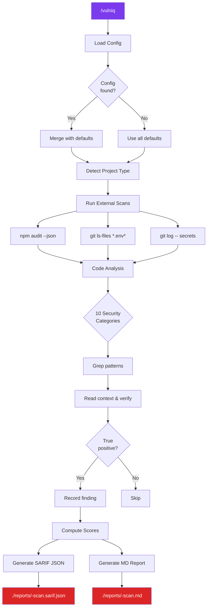
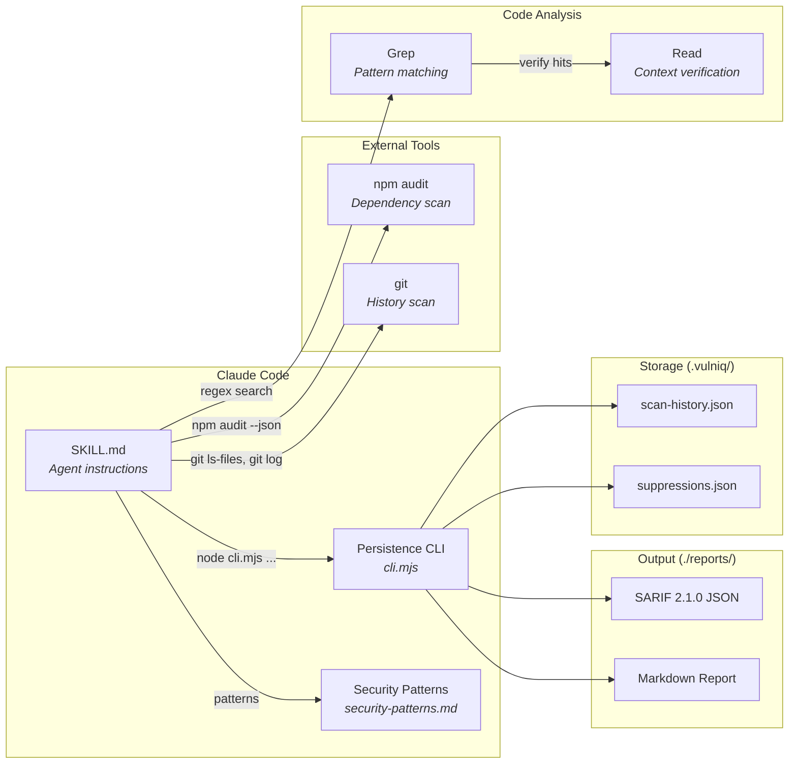

# Vulniq

Autonomous security vulnerability scanner for any codebase. Vulniq systematically scans your project for secrets, XSS, missing security headers, auth issues, OWASP Top 10 patterns, dependency vulnerabilities, and more — then produces a prioritized report with remediation guidance.

## How It Works

Vulniq is a Claude Code skill that turns Claude into an autonomous security auditor. It uses a hybrid approach: Claude's code analysis capabilities combined with external CLI tools (`npm audit`, `git`) for comprehensive coverage. Every grep match is verified by reading surrounding context — no blind pattern matching.



### Key Features

- **Zero config required** — works out of the box on any JavaScript/TypeScript project
- **10 security categories** — secrets, XSS, headers, PII, auth, dependencies, OWASP, CORS, errors, supply chain
- **Hybrid engine** — Claude code analysis + `npm audit` + git history scanning
- **Context-aware verification** — reads surrounding code to eliminate false positives
- **Dual output** — SARIF 2.1.0 JSON (for tooling) + human-readable Markdown report
- **Risk scoring** — per-category scores (0-100) and overall letter grade (A-F)
- **Suppressions** — mark false positives so they don't reappear on future scans
- **Scan history** — track security posture over time
- **Custom patterns** — add project-specific detection rules via config
- **Monorepo support** — scans all workspace packages, groups findings by package

## Prerequisites

- Node.js (any recent version)
- npm/yarn/pnpm (for dependency audit)
- Git (for history scanning)

No additional tools or dependencies required.

## Installation

### Via skills.sh (recommended)

```bash
npx skills add JakubKontra/skills --skill vulniq
```

This installs Vulniq into your project's `.claude/skills/` directory automatically.

### Manual

Copy the `vulniq/` directory into your project's `.claude/skills/` directory:

```bash
mkdir -p .claude/skills
cp -r <path-to-skills-repo>/vulniq .claude/skills/vulniq
```

### Invoke

Once installed, run in Claude Code:
```
/vulniq
```

No config file needed — Vulniq scans the entire project with all checks enabled by default.

## Configuration

Configuration is **optional**. Create `vulniq.config.json` in your project root only if you need to customize behavior.

```bash
cp .claude/skills/vulniq/assets/config.example.json vulniq.config.json
```

### Minimal Config (Disable Some Checks)

```json
{
  "checks": {
    "dependencyChain": { "enabled": false },
    "cors": { "enabled": false }
  }
}
```

### Focus on Critical Issues Only

```json
{
  "severityThreshold": "high",
  "reportTitle": "Critical Security Review"
}
```

### With Custom Patterns

```json
{
  "customPatterns": [
    {
      "id": "CUSTOM-001",
      "pattern": "internal-api\\.mycompany\\.com",
      "fileGlob": "**/*.ts",
      "severity": "high",
      "message": "Internal API URL should not be hardcoded in source code"
    }
  ]
}
```

### With Suppressions

```json
{
  "suppressions": {
    "rules": ["SEC-003"],
    "files": ["**/*.test.*", "**/*.spec.*"],
    "findings": ["SEC-001:apps/crm/environments/.env.development:6"]
  }
}
```

### Full Config Reference

| Field | Type | Required | Default | Description |
|-------|------|----------|---------|-------------|
| `checks.<name>.enabled` | boolean | No | `true` | Enable/disable a check category |
| `checks.<name>.severity` | string | No | varies | Override default severity for a category |
| `exclude` | string[] | No | see below | Glob patterns for files to skip |
| `include` | string[] | No | `[]` | If set, only scan these file patterns |
| `severityThreshold` | string | No | `"low"` | Minimum severity to report (`"critical"`, `"high"`, `"medium"`, `"low"`, `"info"`) |
| `maxFindings` | number | No | `500` | Stop reporting after this many findings |
| `reportTitle` | string | No | `"Security Audit"` | Custom title for report header |
| `customPatterns` | array | No | `[]` | User-defined detection rules |
| `suppressions.rules` | string[] | No | `[]` | Rule IDs to suppress globally |
| `suppressions.files` | string[] | No | `[]` | File globs — suppress all findings in matching files |
| `suppressions.findings` | string[] | No | `[]` | Specific `ruleId:file:line` to suppress |

### Default Exclude Patterns

```json
["node_modules/**", ".git/**", "dist/**", "build/**", ".next/**",
 "coverage/**", "*.min.js", "*.bundle.js", "package-lock.json",
 "yarn.lock", "pnpm-lock.yaml"]
```

## Security Check Categories

Vulniq runs 10 independent security check categories. Each can be enabled/disabled via config.

| ID | Category | Default Severity | What It Detects |
|----|----------|-----------------|-----------------|
| `SEC` | Secrets & Env Files | Critical | API keys, tokens, private keys, .env files committed to git |
| `XSS` | Cross-Site Scripting | High | `dangerouslySetInnerHTML`, `eval()`, `innerHTML`, `document.write()` |
| `HDR` | Security Headers | Medium | Missing CSP, HSTS, X-Frame-Options, X-Content-Type-Options |
| `PII` | PII Exposure | High | Sentry without PII scrubbing, Replay capturing forms, `console.log` leaks |
| `AUTH` | Authentication | High | Tokens in `localStorage`, client-only route protection, missing CSRF |
| `DEP` | Dependencies | High | `npm audit` vulnerabilities mapped to Vulniq severities |
| `OWA` | OWASP Top 10 | High | SQL/NoSQL/command injection, path traversal, open redirects, weak crypto |
| `COR` | CORS | Medium | Wildcard origins, reflective CORS, credentials with wildcard |
| `ERR` | Error Handling | Medium | Stack traces in responses, missing error boundaries |
| `CHN` | Dependency Chain | Medium | Missing lockfile, deprecated packages, suspicious postinstall scripts |

## Architecture



## Scoring System

Vulniq computes a risk score for each category and an overall grade.

### Per-Category Scoring

Each category starts at **100** and deducts points per finding:

| Finding Severity | Point Deduction |
|-----------------|----------------|
| Critical | -30 |
| High | -15 |
| Medium | -5 |
| Low | -2 |
| Info | 0 (listed but no deduction) |

Score floors at 0. Categories with critical findings are weighted 2x in the overall average.

### Letter Grades

| Grade | Score Range | Meaning |
|-------|------------|---------|
| **A** | 90–100 | Minimal risk — good security posture |
| **B** | 75–89 | Low risk — minor issues to address |
| **C** | 60–74 | Moderate risk — significant issues found |
| **D** | 40–59 | High risk — critical issues present |
| **F** | 0–39 | Severe risk — immediate remediation needed |

## Report Output

### Markdown Report (`./reports/<timestamp>-<title>.md`)

The report includes:
- **Executive summary** — 2-3 sentence overview of security posture
- **Risk score table** — overall grade + per-category breakdown
- **Showstoppers** — critical findings with code snippets and remediation steps
- **Findings by severity** — tables with rule ID, file location, description
- **Remediation roadmap** — prioritized checklist (immediate / short-term / medium-term / long-term)
- **Scan metadata** — duration, files scanned, checks run, suppressions applied

### SARIF JSON (`./reports/<timestamp>-<title>.sarif.json`)

Standard [SARIF 2.1.0](https://docs.oasis-open.org/sarif/sarif/v2.1.0/sarif-v2.1.0.html) format compatible with:
- **GitHub Code Scanning** — upload via `gh`
- **VS Code** — [SARIF Viewer extension](https://marketplace.visualstudio.com/items?itemName=MS-SarifVSCode.sarif-viewer)
- **Azure DevOps** — native SARIF support
- Any SARIF-compatible tool

## Persistent Storage

Vulniq creates a `.vulniq/` directory for internal state and writes reports to `./reports/`:

```
project-root/
├── vulniq.config.json          # Optional config (you create this)
├── .vulniq/
│   ├── scan-history.json       # Past scan metadata (dates, scores, finding counts)
│   └── suppressions.json       # CLI-added false positive suppressions
└── reports/
    ├── 2026-03-31T143022-security-audit.md
    └── 2026-03-31T143022-security-audit.sarif.json
```

**What to commit:**
- `reports/` — to track security posture history across the team
- `.vulniq/suppressions.json` — to share agreed false positives

**What to gitignore:**
- `.vulniq/scan-history.json` — local scan tracking (optional to share)

## Suppressions

Vulniq supports two ways to suppress false positives:

### Via Config (`vulniq.config.json`)

```json
{
  "suppressions": {
    "rules": ["SEC-003"],
    "files": ["**/*.test.*", "**/*.spec.*"],
    "findings": ["SEC-001:src/config.ts:42"]
  }
}
```

### Via CLI

```bash
VQ="<skill-directory>/scripts"

# Suppress a specific finding
node $VQ/cli.mjs suppress SEC-001 "src/config.ts:42"

# Suppress an entire rule
node $VQ/cli.mjs suppress SEC-003
```

CLI suppressions are stored in `.vulniq/suppressions.json` and merged with config suppressions at scan time.

## CLI Commands

The persistence CLI can be used directly:

```bash
VQ="<skill-directory>/scripts"

node $VQ/cli.mjs config              # Show resolved config (merged with defaults)
node $VQ/cli.mjs last-run            # Show last scan metadata
node $VQ/cli.mjs history             # Show all past scans with trends
node $VQ/cli.mjs suppress <id> [loc] # Add false positive suppression
node $VQ/cli.mjs save-report <title> # Save report (pipe markdown via stdin)
node $VQ/cli.mjs save-sarif <title>  # Save SARIF (pipe JSON via stdin)
```

All commands output JSON.

## False Positive Avoidance

Vulniq is designed to minimize false positives through context-aware verification:

- **Type definitions are not secrets** — `password: string` in an interface is skipped
- **Test fixtures are lower severity** — hardcoded values in test files are flagged at reduced severity
- **Translation keys are not XSS** — `dangerouslySetInnerHTML` with i18n strings from trusted files is Low
- **NEXT_PUBLIC_ is intentionally public** — only flagged if the value is a true secret (not a public API key)
- **Example/sample files are skipped** — `.example`, `.sample`, `.template` files excluded from secrets scanning
- **Sanitized inputs are downgraded** — `dangerouslySetInnerHTML` with DOMPurify is Medium, not Critical

## Tips

- Run `/vulniq` before every PR to catch security regressions early
- Use `severityThreshold: "high"` for quick triage of critical issues
- The more you run it, the more useful scan history becomes — track your grade improving over time
- Use `customPatterns` for project-specific rules (internal URLs, naming conventions, banned patterns)
- Upload SARIF to GitHub Code Scanning to see findings inline on PRs
- Suppress test files globally with `"suppressions": { "files": ["**/*.test.*"] }` to reduce noise
