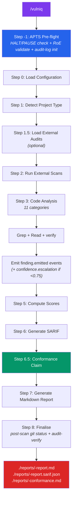
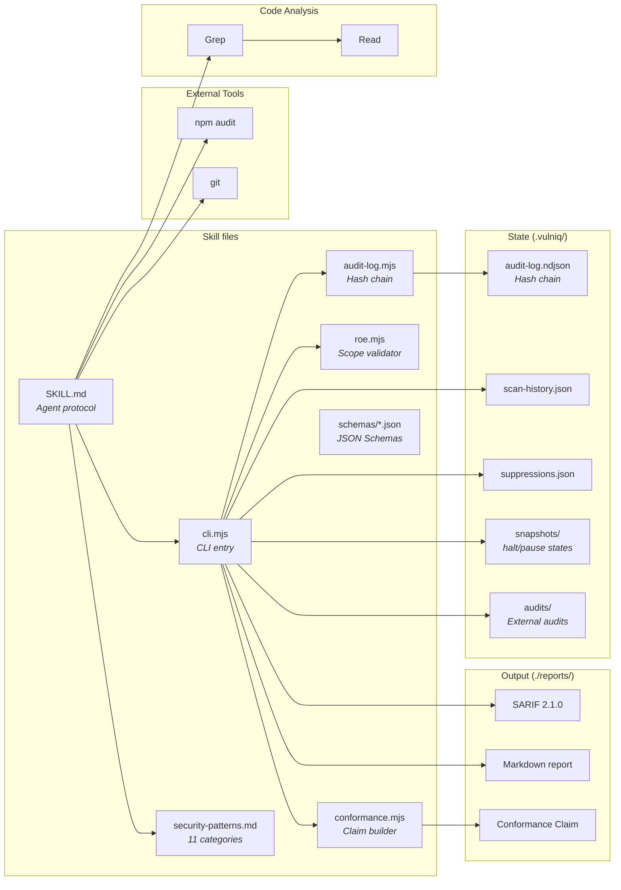

# Vulniq

Autonomous security vulnerability scanner for any codebase, aligned to the **OWASP APTS (Autonomous Penetration Testing Standard) Foundation tier**. Vulniq systematically scans your project for secrets, XSS, missing security headers, auth issues, OWASP Top 10 patterns, dependency vulnerabilities, and more — then produces a prioritized report, a SARIF artefact, and a per-scan **APTS Conformance Claim** — all backed by a tamper-evident, hash-chained audit log.

## What's new in 1.2 (APTS alignment)

- **Governance wrap** across all 8 APTS Foundation domains — 52 met / 7 partial / 12 N/A of 71 Foundation requirements.
- **Rules of Engagement** (`vulniq.roe.json`) formalizes scope, scan window, operator identity, and asset criticality. Validated before any scan.
- **Tamper-evident audit log** — SHA-256 hash-chained NDJSON at `.vulniq/audit-log.ndjson`. Every decision (scan start, file read, finding emission, suppression, halt) gets a signed event. `audit-verify` detects any tampering.
- **Conformance Claim** — `./reports/<ts>-conformance.md` per scan, covering all 8 APTS domains with status + evidence pointers.
- **Kill switch + pause** — `.vulniq/HALT` and `.vulniq/PAUSE` flags halt scans in ≤5 seconds with state snapshots.
- **11th check category: Manipulation Resistance (MR-*)** — detects prompt-injection content in scanned code.
- **JSON Schemas** for the RoE, config, audit log, and SARIF extensions — validate artefacts with `ajv` or VS Code.
- **Distribution** — `npx vulniq <cmd>` and after global install `vulniq <cmd>` both work.
- **GitHub Action** — composite action at `vulniq/actions/vulniq` runs the governance gate in CI and uploads SARIF to Code Scanning.
- **Test suite** — 52 tests (`node --test`, zero deps) lock in hash-chain, RoE, and CLI behaviour.

## How It Works

Vulniq is a Claude Code skill that turns Claude into an autonomous security auditor. It uses a hybrid approach: Claude's code analysis capabilities combined with external CLI tools (`npm audit`, `git`). Every grep match is verified by reading surrounding context — no blind pattern matching. Every decision is written to a hash-chained audit log that the operator can verify post-scan.



## Prerequisites

- Node.js ≥ 18
- `npm` / `yarn` / `pnpm` (for dependency audit)
- Git (for history scanning)

No npm dependencies — Vulniq uses the Node standard library only (this is an audited claim for APTS-TP-006 SBOM).

## Installation

### Via skills.sh (recommended)

```bash
npx skills add JakubKontra/skills --skill vulniq
```

### Manual

```bash
mkdir -p .claude/skills
cp -r <path-to-skills-repo>/vulniq .claude/skills/vulniq
```

### As an npm package (bin wrapper)

```bash
cd .claude/skills/vulniq
npm link          # adds `vulniq` to PATH
vulniq apts-checklist
```

Alternatively, `npx` directly:

```bash
npx .claude/skills/vulniq apts-checklist
```

### Invoke the full scan

In Claude Code:
```
/vulniq
```

## Configuration

Configuration is **optional**. Defaults scan the entire project with all 11 checks enabled.

### Config file (`vulniq.config.json`)

```bash
cp .claude/skills/vulniq/assets/config.example.json vulniq.config.json
```

| Field | Type | Default | Description |
|-------|------|---------|-------------|
| `autonomyLevel` | `L1`/`L2`/`L3`/`L4` | `L3` | APTS Graduated Autonomy level |
| `autonomyLevelOverride` | same or `null` | `null` | Per-run demotion |
| `stepTimeoutMs` | number | `300000` | Per-step soft timeout (APTS-HO-003 SLA) |
| `apts.enabled` | boolean | `true` | Run APTS pre-flight + conformance claim |
| `apts.tier` | string | `"foundation"` | Claimed tier |
| `checks.<name>.enabled` | boolean | `true` | Enable/disable a check category |
| `checks.<name>.severity` | string | varies | Override default severity |
| `exclude` / `include` | string[] | see defaults | Glob filters |
| `severityThreshold` | string | `"low"` | Minimum severity to report |
| `maxFindings` | number | `500` | Cap on findings per scan |
| `reportTitle` | string | `"Security Audit"` | Report header title |
| `customPatterns` | array | `[]` | User-defined detection rules |
| `suppressions` | object | `{}` | False-positive suppressions |

JSON Schema: `vulniq/schemas/config.schema.json`. Examples: `assets/config.example.json`.

### Rules of Engagement (`vulniq.roe.json`) — new in 1.2

The RoE is a separate file that governs scope and authority.

```bash
cp .claude/skills/vulniq/assets/vulniq.roe.example.json vulniq.roe.json
```

```json
{
  "$schema": "../schemas/roe.schema.json",
  "version": "1.0",
  "projectRoot": ".",
  "operator": {
    "name": "Jane Doe",
    "email": "jane@example.com",
    "role": "Security Engineer"
  },
  "scanWindow": {
    "start": "2026-04-01T00:00:00Z",
    "end": "2026-06-30T23:59:59Z"
  },
  "allowedPaths": ["src/**", "apps/**", "packages/**", "*.json"],
  "forbiddenPaths": ["infrastructure/**", "secrets/**"],
  "assetCriticality": {
    "apps/billing/**": "high",
    "apps/auth/**": "high"
  }
}
```

Validate it before running a scan:

```bash
vulniq roe validate      # returns status + scopeHash (emitted to audit log)
vulniq roe hash          # SHA-256 of RoE file only
```

JSON Schema: `vulniq/schemas/roe.schema.json`. See `vulniq/assets/vulniq.roe.example.json` for a full template.

## Security Check Categories

Vulniq runs 11 independent check categories. Each can be enabled/disabled via config.

| ID | Category | Default Severity | What It Detects |
|----|----------|-----------------|-----------------|
| `SEC` | Secrets & Env Files | Critical | API keys, tokens, private keys, `.env` files committed to git |
| `XSS` | Cross-Site Scripting | High | `dangerouslySetInnerHTML`, `eval()`, `innerHTML`, `document.write()` |
| `HDR` | Security Headers | Medium | Missing CSP, HSTS, X-Frame-Options, X-Content-Type-Options |
| `PII` | PII Exposure | High | Sentry without PII scrubbing, Replay capturing forms, `console.log` leaks |
| `AUTH` | Authentication | High | Tokens in `localStorage`, client-only route protection, missing CSRF |
| `DEP` | Dependencies | High | `npm audit` vulnerabilities mapped to Vulniq severities |
| `OWA` | OWASP Top 10 | High | SQL/NoSQL/command injection, path traversal, open redirects, weak crypto |
| `COR` | CORS | Medium | Wildcard origins, reflective CORS, credentials with wildcard |
| `ERR` | Error Handling | Medium | Stack traces in responses, missing error boundaries |
| `CHN` | Dependency Chain | Medium | Missing lockfile, deprecated packages, suspicious postinstall scripts |
| `MR` | **Manipulation Resistance** (APTS D6) | Info | Prompt-injection content, authority claims, delimiter escapes in scanned code |

## APTS Governance

Full alignment map: [`vulniq/references/apts-compliance.md`](../vulniq/references/apts-compliance.md). Machine-readable checklist: [`vulniq/references/apts-foundation.json`](../vulniq/references/apts-foundation.json).

### Coverage at a glance

| Domain | Reqs | Met | Partial | N/A |
|---|---|---|---|---|
| SE — Scope Enforcement | 8 | 6 | 0 | 2 |
| SC — Safety Controls | 6 | 4 | 1 | 1 |
| HO — Human Oversight | 13 | 11 | 2 | 0 |
| AL — Graduated Autonomy | 11 | 6 | 1 | 4 |
| AR — Auditability | 7 | 6 | 1 | 0 |
| MR — Manipulation Resistance | 13 | 8 | 2 | 3 |
| TP — Third-Party & Supply Chain | 10 | 8 | 0 | 2 |
| RP — Reporting | 3 | 3 | 0 | 0 |
| **Total** | **71** | **52** | **7** | **12** |

Live check any time:

```bash
vulniq apts-checklist
```

### The hash-chained audit log

Every event appends one line to `.vulniq/audit-log.ndjson`:

```json
{
  "index": 42,
  "ts": "2026-04-20T14:30:22.417Z",
  "event": "finding.emitted",
  "classification": "STANDARD",
  "decision": { "ruleId": "SEC-001", "severity": "critical", "validationStatus": "VERIFIED" },
  "confidence": 0.92,
  "evidenceHash": "sha256:3f2a…",
  "reasoning": "Matched SEC-001; value length 36 chars; tracked by git",
  "context": { "file": "apps/crm/.env.production", "line": 6 },
  "prevHash": "sha256:9b1e…",
  "thisHash": "sha256:c4d8…"
}
```

`thisHash = sha256(prevHash || canonical(entry_without_thisHash))`. Any mutation breaks the chain.

Verify:

```bash
vulniq audit-verify
# → { "status": "ok", "entries": N, "lastHash": "sha256:..." }
# or
# → { "status": "broken", "firstBadIndex": 12, "reason": "thisHash mismatch at index 12" }
```

Full event catalogue: `vulniq/references/apts-compliance.md` §D5.

### Kill switch + pause (APTS-SC-009, HO-006, HO-008)

```bash
vulniq halt             # creates .vulniq/HALT + dumps state snapshot
vulniq halt-status      # check state
vulniq halt --release   # clear

vulniq pause            # creates .vulniq/PAUSE + dumps state snapshot
vulniq pause-status
vulniq pause --release
```

Both commands auto-dump a state snapshot to `.vulniq/snapshots/<kind>-state-<ts>.json` with audit log index, last entry, RoE summary, autonomy level. `halt` is detected within one step transition (≤5 seconds).

### Conformance Claim

Generate at any time:

```bash
vulniq conformance
# → writes ./reports/<ts>-conformance.md
```

The claim enumerates all 8 domains with status + evidence pointers, includes the Foundation Model disclosure, operator identity from the RoE, posture declaration (CIA impact), and audit-chain integrity status.

## Architecture



## Report Output

Every `/vulniq` scan writes three artefacts to `./reports/`:

| File | What |
|---|---|
| `<ts>-<title>.md` | Human-readable report: executive summary, risk grade, coverage matrix, findings by severity, FP-rate methodology, triage queue, APTS conformance summary |
| `<ts>-<title>.sarif.json` | SARIF 2.1.0 with APTS property extensions: `confidenceScore`, `validationStatus`, `evidenceHash`, `classification` |
| `<ts>-conformance.md` | APTS Conformance Claim — 8 domains, status, evidence pointers, audit-chain integrity, foundation-model disclosure |

### SARIF APTS extensions

Each SARIF result has a `properties` object:

```json
"properties": {
  "confidenceScore": 0.92,
  "validationStatus": "VERIFIED",
  "evidenceHash": "sha256:3f2a7b…",
  "classification": "RESTRICTED"
}
```

JSON Schema: `vulniq/schemas/sarif-properties.schema.json`.

Compatible with:
- **GitHub Code Scanning** — upload via the included action (see below) or `gh`
- **VS Code** — [SARIF Viewer extension](https://marketplace.visualstudio.com/items?itemName=MS-SarifVSCode.sarif-viewer)
- **Azure DevOps** — native SARIF support

## Scoring System

### Per-category scoring

Each category starts at **100** and deducts per finding:

| Severity | Deduction |
|---|---|
| Critical | -30 |
| High | -15 |
| Medium | -5 |
| Low | -2 |
| Info | 0 |

Score floors at 0. Categories with critical findings are weighted 2× in the overall average.

### Letter grades

| Grade | Score | Meaning |
|---|---|---|
| **A** | 90–100 | Minimal risk |
| **B** | 75–89 | Low risk |
| **C** | 60–74 | Moderate risk |
| **D** | 40–59 | High risk |
| **F** | 0–39 | Severe risk |

### Confidence rubric (APTS-RP-006 — published in every report)

| Score | Meaning |
|---|---|
| 1.0 | Verified; context confirms exploitability |
| 0.9 | Verified true positive |
| 0.7 | Likely TP, one context branch not fully inspected |
| 0.5 | Ambiguous; operator triage required |
| 0.3 | Likely FP; surfaced only because rule was borderline |

Findings with `confidenceScore < 0.75` emit a `confidence.escalation` event AND appear in the report's **Needs Triage** section.

## CI/CD integration

### GitHub Action

A composite action is shipped at `vulniq/actions/vulniq/action.yml`. It runs the **governance gate** (validate RoE, verify chain, generate conformance claim, upload SARIF). It does NOT run the actual scan — that requires Claude Code driving Grep + Read loops.

Minimal usage:

```yaml
- uses: actions/checkout@v4
- uses: actions/setup-node@v4
  with: { node-version: 20 }
- uses: ./vulniq/actions/vulniq
  with:
    sarif-path: reports/latest-scan.sarif.json     # optional
```

See `vulniq/actions/vulniq/README.md` for the full input reference and an example workflow at `.github/workflows/vulniq-example.yml`.

### JSON Schemas (validate before invoking)

Validate the RoE before Claude Code runs:

```bash
npx -y ajv-cli@5 validate --spec=draft2020 --strict=false \
  -s vulniq/schemas/roe.schema.json \
  -d vulniq.roe.json
```

All schemas live under `vulniq/schemas/` with a usage README.

## Persistent Storage

```
project-root/
├── vulniq.config.json            # optional — operator creates
├── vulniq.roe.json               # optional — operator creates (Rules of Engagement)
├── .vulniq/
│   ├── audit-log.ndjson          # APTS hash-chained event log (never hand-edit)
│   ├── scan-history.json         # per-scan metadata
│   ├── suppressions.json         # CLI-added false positives
│   ├── snapshots/                # halt/pause state dumps
│   │   ├── halt-state-<ts>.json
│   │   └── pause-state-<ts>.json
│   ├── HALT                      # kill-switch flag (presence halts)
│   ├── PAUSE                     # pause flag (presence pauses)
│   └── audits/                   # Ingested EXTERNAL audit documents
│       └── <slug>.json
└── reports/
    ├── <ts>-scan.md
    ├── <ts>-scan.sarif.json
    └── <ts>-conformance.md       # APTS Conformance Claim per scan
```

**Commit to VCS:**
- `vulniq.roe.json` and `vulniq.config.json` — the governance inputs
- `reports/` — track posture history
- `.vulniq/suppressions.json` — shared false-positive decisions
- `.vulniq/audit-log.ndjson` — audit trail (consider gitignore if repo is public and RESTRICTED events may leak)

**Gitignore:**
- `.vulniq/HALT`, `.vulniq/PAUSE` — ephemeral flags
- `.vulniq/snapshots/` — debug-only state dumps

## Two "audits" — easy to confuse

Vulniq uses the word "audit" in two unrelated senses. Remember:

| Concept | Path | What it is |
|---|---|---|
| **External audit** | `.vulniq/audits/<slug>.json` | Pen-test reports or security reviews that Vulniq ingests to track remediation (`ingest-audit` CLI) |
| **Audit log** | `.vulniq/audit-log.ndjson` | Vulniq's own hash-chained event trail required by APTS-AR-012 (`audit-log` + `audit-verify` CLI) |

## CLI Reference

All commands output JSON to stdout.

```bash
# Core CLI  (all of these also work via `vulniq <cmd>` after `npm link`
# or `npx .claude/skills/vulniq <cmd>`; examples below use the short form)

vulniq config                         # Show resolved config
vulniq last-run                       # Last scan summary
vulniq history                        # All past scans
vulniq suppress <ruleId> [file:line]  # Add suppression
vulniq save-report <title>            # Save MD report (stdin: markdown)
vulniq save-sarif <title>             # Save SARIF (stdin: JSON)
vulniq ingest-audit <title>           # Ingest external audit (stdin: JSON)
vulniq list-audits                    # List ingested external audits

# APTS (new in 1.2)
vulniq roe validate                   # Validate RoE, emit scope.hash.recorded
vulniq roe show                       # Print parsed RoE
vulniq roe hash                       # SHA-256 of RoE file
vulniq audit-log <event>              # Append to hash chain (stdin: JSON)
vulniq audit-verify                   # Verify chain integrity
vulniq halt [--release]               # Kill switch (with state dump)
vulniq halt-status
vulniq pause [--release]              # Pause with state dump
vulniq pause-status
vulniq conformance                    # Generate APTS Conformance Claim
vulniq apts-checklist                 # Live per-domain coverage summary
```

Long form (no `npm link`) is `node <skill-dir>/scripts/cli.mjs <cmd>` — the same thing.

## Testing

Vulniq ships a 52-test suite (zero deps, `node:test`):

```bash
cd .claude/skills/vulniq
npm test
```

Covers: hash-chain validity, chain-break detection, `roe` validation flows, `isInScope` glob matching, `validateScanWindow`, conformance claim structure, CLI integration (halt/pause/conformance/audit-verify). See `vulniq/test/README.md`.

## Suppressions

### Via config

```json
{
  "suppressions": {
    "rules": ["SEC-003"],
    "files": ["**/*.test.*", "**/*.spec.*"],
    "findings": ["SEC-001:src/config.ts:42"]
  }
}
```

### Via CLI

```bash
vulniq suppress SEC-001 "src/config.ts:42"   # Specific finding
vulniq suppress SEC-003                       # Entire rule
```

CLI suppressions are stored in `.vulniq/suppressions.json` and merged with config at scan time. Each suppression that blocks a finding emits a `suppression.applied` event to the audit log.

## False Positive Avoidance

Vulniq's verification doctrine ("every grep match is a candidate, not a finding") and the confidence rubric combine to minimize false positives:

- **Type definitions are not secrets** — `password: string` in an interface is skipped
- **Test fixtures are lower severity** — hardcoded values in test files are flagged at reduced severity
- **Translation keys are not XSS** — `dangerouslySetInnerHTML` with i18n strings from trusted files is Low
- **NEXT_PUBLIC_ is intentionally public** — only flagged if the value is a true secret
- **Example/sample files are skipped** — `.example`, `.sample`, `.template` files excluded from secrets scanning
- **Sanitized inputs are downgraded** — `dangerouslySetInnerHTML` with DOMPurify is Medium, not Critical
- **MR findings are observations, not vulnerabilities** — prompt-injection-shaped strings in scanned code are `info` (the scanner never acts on them)

## Audit Knowledge Enrichment (external audits)

Vulniq can ingest external audit documents (penetration test reports, security reviews, compliance audits) and track remediation progress across scans — independent of the APTS audit log.

1. **Ingest**: provide the audit document to Claude; the agent extracts findings to structured JSON and pipes them to `vulniq ingest-audit "<title>"`.
2. **Scan**: on each `/vulniq` run, mapped audit findings are cross-referenced against scan results.
3. **Report**: the markdown report includes an "Audit Remediation Status" section.

| Status | Meaning |
|---|---|
| **Still open** | Audit finding confirmed still present |
| **Fixed** | Audit finding no longer detected |
| **Not scanned** | Outside scan scope (e.g., backend infra) |
| **Not mapped** | No corresponding Vulniq rule exists |

## Tips

- Run `/vulniq` before every PR to catch security regressions early.
- Use `severityThreshold: "high"` for quick triage of critical issues only.
- Check the audit log after every scan: `vulniq audit-verify` — any `broken` return means someone (or something) has touched the log.
- Suppress test files with `{"suppressions": {"files": ["**/*.test.*"]}}` to reduce noise.
- Pair with the GitHub Action to auto-upload SARIF to Code Scanning on every push.
- Version-control your `vulniq.roe.json` — it's the authoritative boundary document under APTS-AL-014.
- If you're claiming APTS conformance externally, ship the `./reports/<ts>-conformance.md` with the rest of the scan deliverables.

## Links

- **Worked example** (end-to-end `/vulniq` session): [`vulniq/docs/worked-example.md`](../vulniq/docs/worked-example.md)
- **CHANGELOG**: [`vulniq/CHANGELOG.md`](../vulniq/CHANGELOG.md)
- **Migration guide** (1.1 → 1.2): [`vulniq/MIGRATION.md`](../vulniq/MIGRATION.md)
- OWASP APTS standard: https://github.com/OWASP/APTS (CC BY-SA 4.0)
- Vulniq APTS compliance map: [`vulniq/references/apts-compliance.md`](../vulniq/references/apts-compliance.md)
- Manipulation-resistance doctrine: [`vulniq/references/manipulation-resistance.md`](../vulniq/references/manipulation-resistance.md)
- Schema reference: [`vulniq/schemas/README.md`](../vulniq/schemas/README.md)
- GitHub Action: [`vulniq/actions/vulniq/README.md`](../vulniq/actions/vulniq/README.md)
- Test suite: [`vulniq/test/README.md`](../vulniq/test/README.md)
